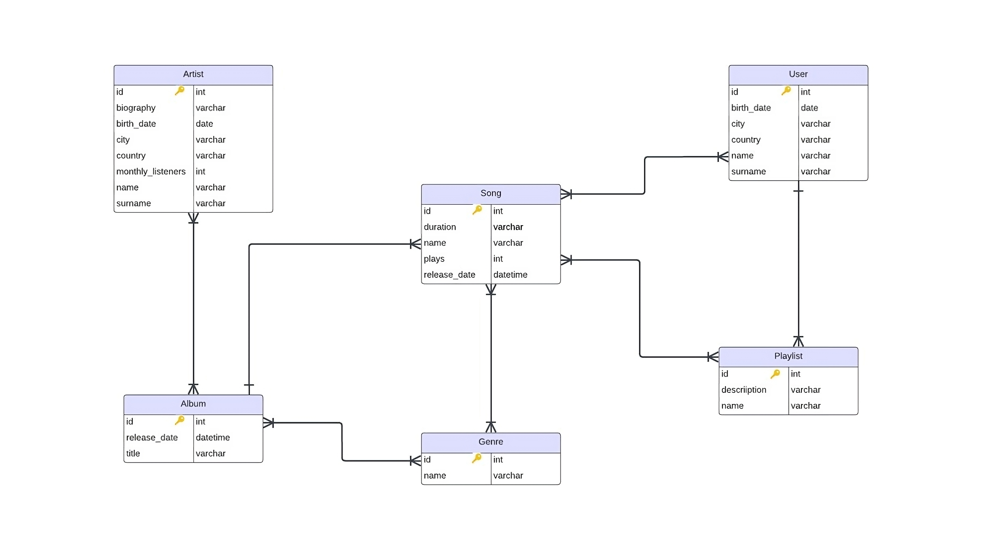

# Sound

## About the project
"Sound" is the innovative application we intend to build, aiming to fully implement the logic, features, and functionalities of a digital music streaming service. Our goal is to provide a seamless and immersive music listening experience, allowing the integration of features that redefine the way people engage with music.

## Getting started
Build the project with the following steps:
1. Clone the repository
2. Open the project in your IDE (IntelliJ IDEA recommended)
3. Make sure you are using the JDK version 17.0.9 and Gradle version 8.5
4. Browse the Gradle `build.gradle` file for details of dependencies and versions used in the project  
Dependencies used in the project:
   - Spring Web
   - MySQL Driver
   - Validation
   - Mockito
5. Configure the database connection in the `application.properties` file (check the [Database](#database) section below for more info)
6. Run the project

## Tests
Mockito, a Java-based framework used for unit testing, is used to test some services of the project, ensuring the reliability and functionality of key components.  

To run the tests, you have a couple of options:
- Run all tests using the command `./gradlew test` in the project's root directory. 
- Open the project in your preferred IDE (IntelliJ IDEA recommended), navigate to the `src/test/java` directory, and right-click on the package or individual test file. Choose the "Run [TestName]" option from the context menu.

## Database
MySQL or MariaDB can be used as the database for this project. Prior to configuring the database connection you have to create a database. The database connection can be configured in the application.properties file, with the appropriate values for the following properties:
```
server.port=8080

spring.datasource.url=jdbc:mysql://localhost:3306/[database_name]  
spring.datasource.username=[username]

spring.jpa.properties.hibernate.dialect=org.hibernate.dialect.MySQLDialect  
spring.jpa.hibernate.ddl-auto=update

spring.jpa.show-sql=true
```

## Diagram
The Entity-Relationship (ER) Diagram illustrates the structure of our database. This visual representation showcases the relationships between entities in our system. Use the diagram as a reference to understand the data model and the connections between key components in our application.
### E-R Diagram


## API Root Endpoint
`http://localhost:8080`

